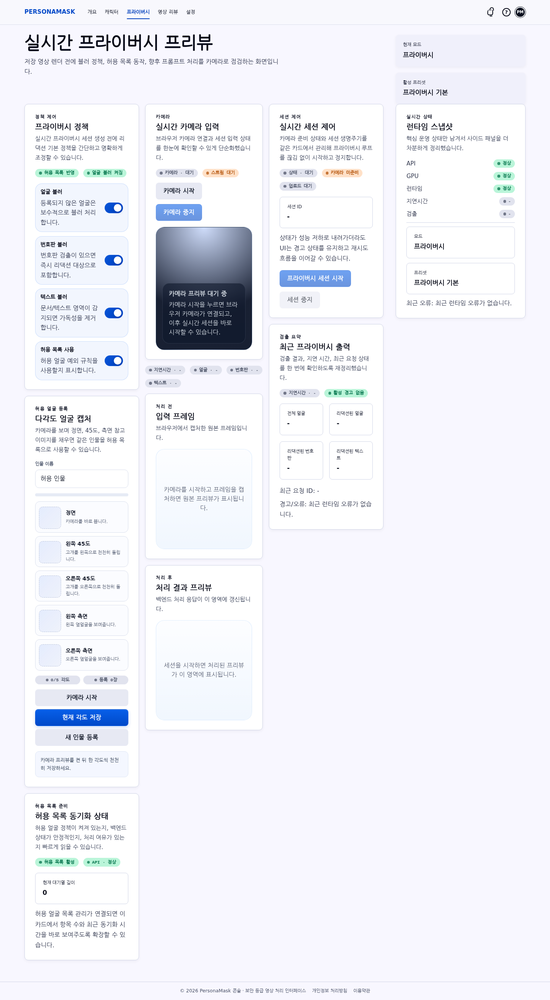
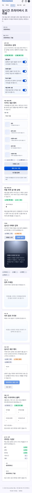
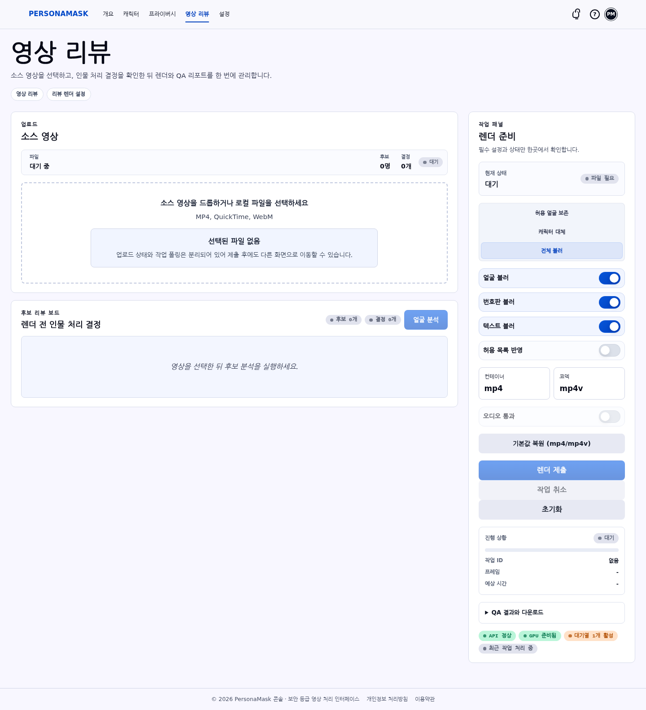
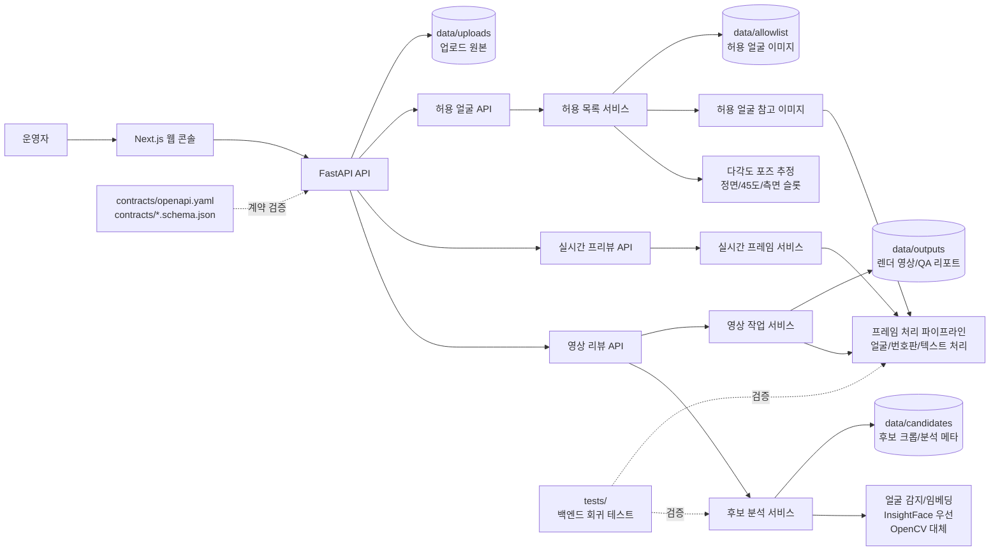

# PersonaMask

PersonaMask는 영상 속 얼굴, 번호판, 텍스트처럼 식별 위험이 있는 영역을 검토하고 처리하는 프라이버시 콘솔입니다.

현재 제품 흐름은 두 축으로 구성되어 있습니다.

- **영상 리뷰**: 소스 영상을 업로드하고 얼굴 후보를 검토한 뒤, 보존/캐릭터 대체/블러 결정을 렌더링과 QA 리포트에 반영합니다.
- **실시간 프라이버시 프리뷰**: 카메라 입력으로 블러 정책과 허용 목록 동작을 점검하고, 다각도 얼굴 캡처로 허용 인물 참고 이미지를 등록합니다.

## 미리보기

### 실시간 프라이버시 프리뷰



모바일 화면에서도 같은 기능이 카드 단위로 정렬됩니다.



### 영상 리뷰



## 핵심 기능

- **다각도 허용 얼굴 등록**: 정면, 왼쪽 45도, 오른쪽 45도, 왼쪽 측면, 오른쪽 측면 이미지를 카메라로 채워 같은 인물을 허용 목록 참고 이미지로 저장합니다.
- **허용 목록 기반 보존 처리**: 등록된 얼굴 참고 이미지가 있으면 실시간 프라이버시 처리에서 해당 인물을 보존 대상으로 매칭합니다.
- **실시간 프라이버시 프리뷰**: 얼굴/번호판/텍스트 블러 정책과 허용 목록 사용 여부를 카메라 입력으로 확인합니다.
- **후보 리뷰 보드**: 업로드한 영상을 샘플링해 얼굴 후보를 추출하고, `preserve`, `character`, `blur`, `track` 결정을 지원합니다.
- **결정 기반 렌더링**: 얼굴 임베딩 또는 대체 매칭 정보가 있을 때 후보별 결정을 프레임 처리에 적용합니다.
- **리댁션 QA 리포트**: 렌더 완료 후 `qa-report.json`, `qa-report.md`, 전후 비교 시트를 생성합니다.
- **보호된 산출물 다운로드**: 후보 크롭, 렌더 영상, 전후 비교 시트, QA 리포트는 발급된 `X-Access-Token`이 있어야 받을 수 있습니다.

다각도 얼굴 등록은 사용자를 인증하는 기능이 아닙니다. 프라이버시 처리에서 “블러하지 않을 사람”을 더 안정적으로 찾기 위한 참고 이미지 수집 흐름입니다.

## 아키텍처



## 주요 화면

- **영상 리뷰**: 소스 영상 업로드, 후보 분석, 인물별 처리 결정, 렌더 제출, QA 산출물 다운로드.
- **프라이버시**: 실시간 카메라 입력, 블러 정책 제어, 다각도 허용 얼굴 캡처, 처리 전/후 프리뷰.
- **캐릭터**: 캐릭터 기반 대체 처리 흐름을 위한 세션 제어 화면.
- **설정**: 런타임 상태와 프리셋 확인.

## 얼굴 감지 상태

후보 리뷰 품질을 보장하려면 InsightFace `buffalo_l` 경로를 사용하는 것이 좋습니다.

`bys` conda 환경에서 `test_video.mp4`로 확인한 최근 결과:

- 영상: 312프레임, 1080x1920, 약 30 FPS.
- 후보 추출: 인물 후보 3명.
- 후보 클러스터 크기: 28, 18, 17.
- 샘플 프레임: 52개.
- 얼굴이 감지된 샘플 프레임: 40/52.
- 얼굴이 감지된 프레임의 후보 매칭률: 100%.
- `tests.test_video_identity_quality` 통과.

OpenCV Haar 대체 경로는 운영용 후보 리뷰 품질로 보기 어렵습니다. InsightFace 초기화가 실패하면 대체 실행은 가능하지만, 후보 수와 매칭률이 흔들릴 수 있습니다.

## 기술 스택

- 백엔드: FastAPI, OpenCV, ONNX Runtime, 선택적 InsightFace/ArcFace.
- 프론트엔드: Next.js App Router, React, TypeScript.
- 계약 문서: `contracts/openapi.yaml`, `contracts/video.schema.json`, `contracts/realtime.schema.json`.
- 런타임 데이터: `data/uploads`, `data/candidates`, `data/outputs`, `data/allowlist`.

## 로컬 실행

백엔드:

```bash
python -m venv .venv
source .venv/bin/activate
pip install -r requirements.txt
cp .env.example .env
python -m app.main --check
python -m app.main --host 127.0.0.1 --port 8001
```

프론트엔드:

```bash
cd web
npm install
npm run dev
```

기본 프론트엔드 주소: `http://127.0.0.1:3000`

## 주요 API

영상 리뷰:

- `POST /api/v1/videos/candidates`
- `GET /api/v1/videos/candidates/{analysis_id}/{candidate_id}` (`X-Access-Token` 필요)
- `POST /api/v1/videos/jobs`
- `GET /api/v1/videos/jobs/{job_id}` (`X-Access-Token` 필요)
- `POST /api/v1/videos/jobs/{job_id}/cancel` (`X-Access-Token` 필요)
- `GET /api/v1/videos/jobs/{job_id}/result` (`X-Access-Token` 필요)
- `GET /api/v1/videos/jobs/{job_id}/contact-sheet` (`X-Access-Token` 필요)
- `GET /api/v1/videos/jobs/{job_id}/qa-report.json` (`X-Access-Token` 필요)
- `GET /api/v1/videos/jobs/{job_id}/qa-report.md` (`X-Access-Token` 필요)

실시간 프리뷰와 허용 얼굴:

- `POST /api/v1/realtime/sessions`
- `POST /api/v1/realtime/sessions/{session_id}/frames`
- `DELETE /api/v1/realtime/sessions/{session_id}`
- `POST /api/v1/realtime/face-pose`
- `POST /api/v1/allowlist/faces`
- `GET /api/v1/allowlist/faces`
- `DELETE /api/v1/allowlist/faces/{person_id}`

운영 상태:

- `GET /api/v1/health`
- `GET /api/v1/diagnostics/runtime`
- `GET /api/v1/presets`

## 환경 변수

일반 백엔드 설정값은 `.env.example`에 정리되어 있습니다.

신원 감지 관련 주요 값:

```bash
PERSONAMASK_FACE_DETECTOR=auto
PERSONAMASK_INSIGHTFACE_ROOT=/home/bys0626/.insightface
PERSONAMASK_INSIGHTFACE_MODEL=buffalo_l
PERSONAMASK_ONNXRUNTIME_PROVIDER=CPUExecutionProvider
PERSONAMASK_INSIGHTFACE_CTX_ID=-1
```

`CUDAExecutionProvider`는 호스트 GPU 드라이버와 ONNX Runtime CUDA 경로를 먼저 검증한 뒤 사용해야 합니다. GPU 경로가 준비되지 않았거나 InsightFace 초기화가 실패하면 OpenCV 대체 경로로 실행됩니다.

## 검증

백엔드 전체 테스트:

```bash
NO_ALBUMENTATIONS_UPDATE=1 MPLCONFIGDIR=/tmp/matplotlib PYTHONPYCACHEPREFIX=/tmp/pycache \
  conda run --no-capture-output -n bys python -m unittest discover -s tests -v
```

얼굴 감지 회귀 테스트:

```bash
NO_ALBUMENTATIONS_UPDATE=1 MPLCONFIGDIR=/tmp/matplotlib \
  conda run --no-capture-output -n bys python -m unittest tests.test_video_identity_quality -v
```

프론트엔드 검증:

```bash
npm --prefix web run typecheck
npm --prefix web run lint
npm --prefix web run build
```

`tests/test_video_identity_quality.py`는 로컬에 `test_video.mp4`가 있을 때 실제 영상 기반으로 동작합니다. 실제 사람이 포함된 테스트 영상은 공개 저장소에 올리지 말고 로컬 파일로 유지하세요.

## 라이선스

MIT 라이선스입니다. 자세한 내용은 [`LICENSE`](./LICENSE)를 확인하세요.
