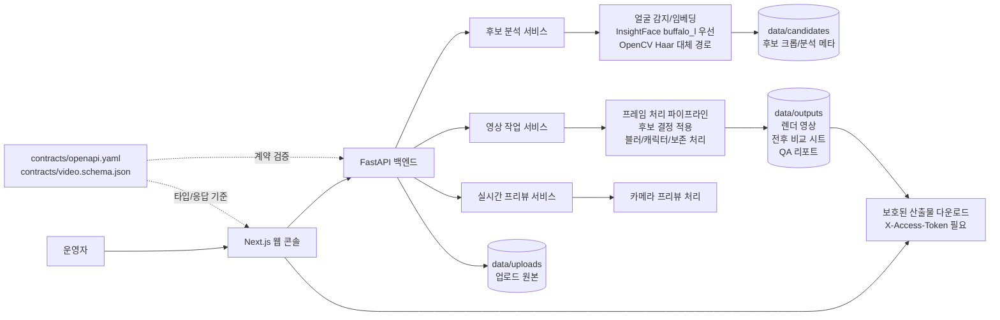

# PersonaMask

PersonaMask는 저장 영상을 업로드한 뒤 얼굴 후보를 검토하고, 인물별 처리 방식을 결정한 다음, 리댁션 영상과 QA 산출물을 내려받는 프라이버시 리뷰 콘솔입니다.

사용자가 영상을 올리고, 감지된 얼굴 후보를 확인하고, 각 인물에 대해 보존/캐릭터 대체/블러/추적 결정을 내린 뒤, 렌더 결과와 QA 리포트로 처리 내용을 검증합니다.

## 미리보기


## 현재 UI

영상 리뷰 화면은 조용한 2단 작업 공간으로 구성되어 있습니다.

- 왼쪽: 소스 영상 업로드와 후보 리뷰 보드.
- 오른쪽: 렌더 설정, 진행 상황, QA 다운로드, 런타임 상태를 모은 단일 작업 패널.
- QA 결과는 기본적으로 접혀 있어, 결과 확인이 필요할 때만 펼쳐 봅니다.

이 구조는 업로드, 후보 분석, 렌더 제출, 산출물 검토 흐름에만 시선을 집중시키기 위한 구성입니다.

## 아키텍처



## 핵심 기능

- **후보 리뷰 보드**: 업로드한 영상을 샘플링해 얼굴 후보를 추출하고, `preserve`, `character`, `blur`, `track` 결정을 지원합니다.
- **결정 기반 렌더링**: 신원 임베딩이 있을 때 후보별 결정을 렌더 과정에 적용합니다.
- **리댁션 QA 리포트**: 렌더 완료 후 `qa-report.json`, `qa-report.md`, 전후 비교 시트를 생성합니다.
- **보호된 산출물**: 후보 크롭, 렌더 영상, 전후 비교 시트, QA 리포트는 발급된 `X-Access-Token`이 있어야 받을 수 있습니다.
- **실시간 프리뷰**: 카메라 기반 프라이버시 프리뷰는 보조 점검과 캘리브레이션 용도로 유지합니다.

## 얼굴 감지 상태

후보 리뷰 품질을 보장하려면 InsightFace `buffalo_l` 경로를 사용해야 합니다.

`bys` conda 환경에서 `test_video.mp4`로 확인한 최근 결과:

- 영상: 312프레임, 1080x1920, 약 30 FPS.
- 후보 추출: 인물 후보 3명.
- 후보 클러스터 크기: 28, 18, 17.
- 샘플 프레임: 52개.
- 얼굴이 감지된 샘플 프레임: 40/52.
- 얼굴이 감지된 프레임의 후보 매칭률: 100%.
- `tests.test_video_identity_quality` 통과.

OpenCV Haar 대체 경로는 품질 저하 상태입니다. 같은 영상에서 후보를 6명으로 과다 추출했고, 임베딩이 없었으며, 얼굴이 있는 샘플 프레임 34개 중 8개만 후보와 매칭했습니다. 이 경로를 운영용 인물 검토 품질로 보면 안 됩니다.

## 기술 스택

- 백엔드: FastAPI, OpenCV, ONNX Runtime, 선택적 InsightFace/ArcFace.
- 프론트엔드: Next.js App Router, React, TypeScript.
- 계약 문서: `contracts/openapi.yaml`, `contracts/video.schema.json`.
- 런타임 데이터: `data/uploads`, `data/outputs`, `data/candidates`, 로컬 상태 파일.

## 로컬 실행

백엔드:

```bash
python -m venv .venv
source .venv/bin/activate
pip install -r requirements.txt
cp .env.example .env
python -m app.main --check
python -m app.main --host 127.0.0.1 --port 8001
```

프론트엔드:

```bash
cd web
npm install
npm run dev
```

기본 프론트엔드 주소: `http://127.0.0.1:3000`

## 영상 리뷰 API

주요 엔드포인트:

- `POST /api/v1/videos/candidates`
- `GET /api/v1/videos/candidates/{analysis_id}/{candidate_id}` (`X-Access-Token` 필요)
- `POST /api/v1/videos/jobs`
- `GET /api/v1/videos/jobs/{job_id}` (`X-Access-Token` 필요)
- `POST /api/v1/videos/jobs/{job_id}/cancel` (`X-Access-Token` 필요)
- `GET /api/v1/videos/jobs/{job_id}/result` (`X-Access-Token` 필요)
- `GET /api/v1/videos/jobs/{job_id}/contact-sheet` (`X-Access-Token` 필요)
- `GET /api/v1/videos/jobs/{job_id}/qa-report.json` (`X-Access-Token` 필요)
- `GET /api/v1/videos/jobs/{job_id}/qa-report.md` (`X-Access-Token` 필요)

후보 처리 결정:

- `preserve`: 해당 인물을 그대로 보존합니다.
- `character`: 해당 인물을 선택한 캐릭터 스타일로 대체합니다.
- `blur`: 해당 인물을 블러 처리합니다.
- `track`: 해당 인물을 프레임 전반에서 추적 대상으로 유지합니다.

## 실시간 프리뷰 API

실시간 엔드포인트는 프라이버시 프리뷰와 캘리브레이션 용도로 유지합니다.

- `GET /api/v1/health`
- `GET /api/v1/diagnostics/runtime`
- `GET /api/v1/presets`
- `POST /api/v1/realtime/sessions`
- `POST /api/v1/realtime/sessions/{session_id}/frames`
- `DELETE /api/v1/realtime/sessions/{session_id}`
- `POST /api/v1/allowlist/faces`
- `GET /api/v1/allowlist/faces`
- `DELETE /api/v1/allowlist/faces/{person_id}`

## 환경 변수

일반 백엔드 설정값은 `.env.example`에 정리되어 있습니다.

신원 감지 관련 주요 값:

```bash
PERSONAMASK_FACE_DETECTOR=auto
PERSONAMASK_INSIGHTFACE_ROOT=/home/bys0626/.insightface
PERSONAMASK_INSIGHTFACE_MODEL=buffalo_l
PERSONAMASK_ONNXRUNTIME_PROVIDER=CPUExecutionProvider
PERSONAMASK_INSIGHTFACE_CTX_ID=-1
```

`CUDAExecutionProvider`는 호스트 GPU 드라이버와 ONNX Runtime CUDA 경로를 먼저 검증한 뒤 사용해야 합니다. InsightFace 초기화가 실패하면 현재 코드는 OpenCV로 대체 실행되며, 이 경로는 후보 리뷰 품질이 낮습니다.

## 검증

백엔드 전체 테스트:

```bash
NO_ALBUMENTATIONS_UPDATE=1 MPLCONFIGDIR=/tmp/matplotlib PYTHONPYCACHEPREFIX=/tmp/pycache \
  conda run --no-capture-output -n bys python -m unittest discover -s tests -v
```

얼굴 감지 회귀 테스트:

```bash
NO_ALBUMENTATIONS_UPDATE=1 MPLCONFIGDIR=/tmp/matplotlib \
  conda run --no-capture-output -n bys python -m unittest tests.test_video_identity_quality -v
```

프론트엔드 검증:

```bash
npm --prefix web run typecheck
npm --prefix web run lint
```

`tests/test_video_identity_quality.py`는 로컬에 `test_video.mp4`가 있을 때 실제 영상 기반으로 동작합니다. 영상에 실제 사람이 포함되어 있으면 공개 저장소에 올리지 말고 로컬 파일로 유지하세요.

## 라이선스

MIT 라이선스입니다. 자세한 내용은 [`LICENSE`](./LICENSE)를 확인하세요.
