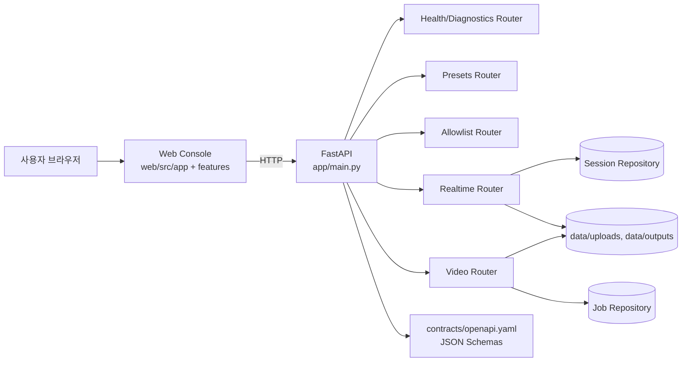
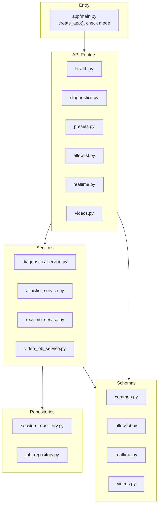
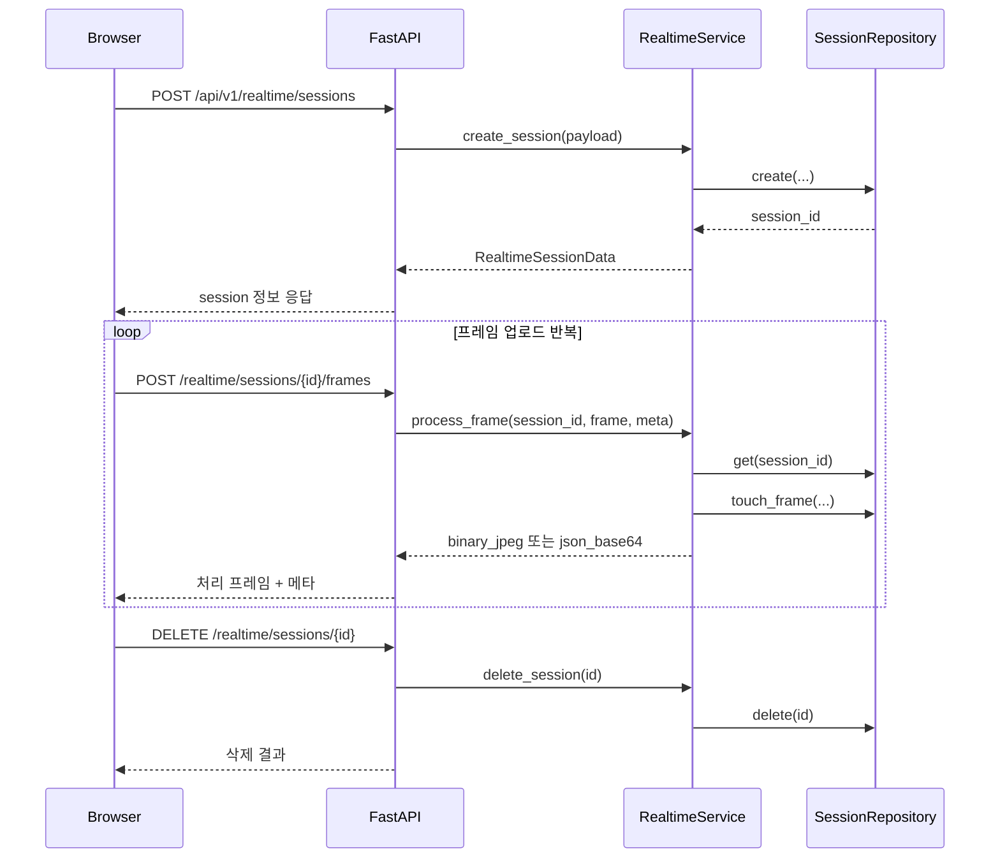
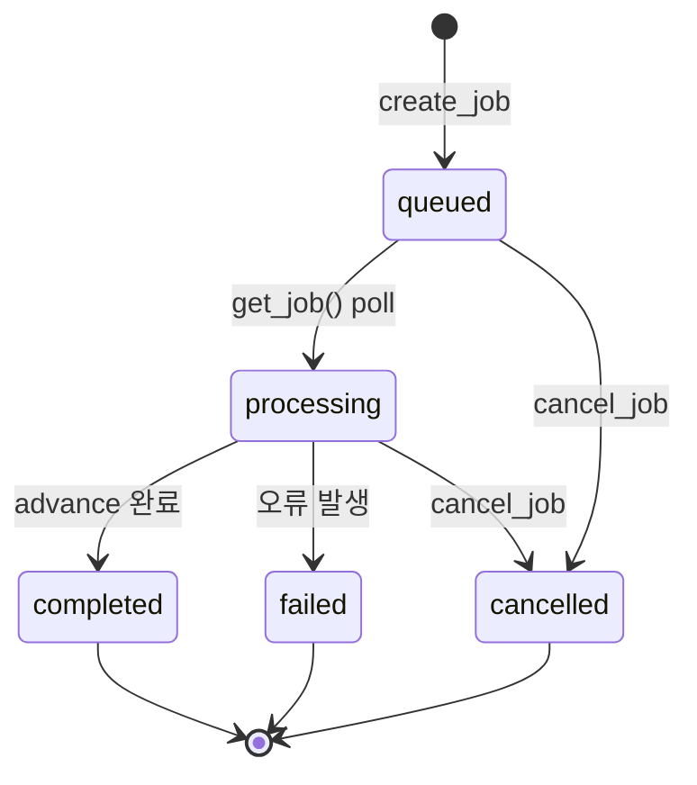

# PersonaMask

Character Mask + Privacy Redaction 콘솔 프로젝트입니다.

이 저장소는 **FastAPI 백엔드 스켈레톤**과 **웹 콘솔 프론트엔드 스캐폴딩**을 포함합니다.
현재 기준으로 핵심 흐름은 다음 두 가지입니다.

- 실시간 세션 기반 처리 (`/api/v1/realtime/*`)
- 비디오 배치 작업 처리 (`/api/v1/videos/*`)

---

## 목차

1. [프로젝트 개요](#프로젝트-개요)
2. [파일 구조](#파일-구조)
3. [아키텍처 (Mermaid)](#아키텍처-mermaid)
4. [사용자 가이드](#사용자-가이드)
5. [개발자 가이드](#개발자-가이드)
6. [API 요약](#api-요약)

---

## 프로젝트 개요

### 목표

- 웹캠/프레임 입력에 대해 캐릭터 마스크 또는 프라이버시 처리를 수행할 수 있는 API와 UI 기반 제공
- 배치 비디오 업로드 → 상태 추적 → 결과 다운로드 흐름 제공
- 프론트엔드/백엔드 계약을 `contracts/openapi.yaml` 중심으로 관리

### 현재 상태

- 백엔드: 동작 가능한 스켈레톤(health/diagnostics/presets/allowlist/realtime/videos)
- 프론트엔드: 라우트/컴포넌트/훅/서비스/스토어 스캐폴딩
- 실제 고도화 추론/모델 파이프라인은 이후 확장 대상

---

## 파일 구조

```text
.
├─ .env.example
├─ .gitignore
├─ requirements.txt
├─ app/
│  ├─ main.py
│  ├─ api/
│  │  └─ routers/
│  │     ├─ health.py
│  │     ├─ diagnostics.py
│  │     ├─ presets.py
│  │     ├─ allowlist.py
│  │     ├─ realtime.py
│  │     └─ videos.py
│  ├─ core/
│  │  ├─ config.py
│  │  └─ gpu.py
│  ├─ repositories/
│  │  ├─ session_repository.py
│  │  └─ job_repository.py
│  ├─ schemas/
│  │  ├─ common.py
│  │  ├─ allowlist.py
│  │  ├─ realtime.py
│  │  └─ videos.py
│  └─ services/
│     ├─ diagnostics_service.py
│     ├─ allowlist_service.py
│     ├─ realtime_service.py
│     └─ video_job_service.py
├─ contracts/
│  ├─ openapi.yaml
│  ├─ errors.schema.json
│  ├─ realtime.schema.json
│  └─ video.schema.json
└─ web/
   ├─ public/
   │  └─ presets-preview/
   └─ src/
      ├─ app/
      │  ├─ page.tsx
      │  ├─ layout.tsx
      │  ├─ character/page.tsx
      │  ├─ privacy/page.tsx
      │  ├─ video/page.tsx
      │  └─ settings/page.tsx
      ├─ components/
      │  ├─ camera/
      │  ├─ common/
      │  ├─ diagnostics/
      │  ├─ preview/
      │  └─ uploader/
      ├─ features/
      │  ├─ character/
      │  ├─ privacy/
      │  ├─ video/
      │  └─ allowlist/
      ├─ hooks/
      ├─ services/
      ├─ store/
      ├─ lib/
      └─ types/
```

---

## 아키텍처 (Mermaid)

### 1) 시스템 컴포넌트 아키텍처



### 2) 백엔드 내부 계층 아키텍처



### 3) 실시간 프레임 처리 시퀀스



### 4) 비디오 배치 작업 상태 전이



---

## 사용자 가이드

> 현재 프로젝트는 **개발자/테스터용 스켈레톤** 중심입니다.

### 1) 준비

```bash
cd /path/to/PersonaMask
python -m venv .venv
source .venv/bin/activate
pip install -r requirements.txt
cp .env.example .env
```

### 2) 런타임 점검

```bash
python -m app.main --check
```

- GPU provider, 환경값, 기본 상태를 JSON으로 출력합니다.

### 3) 서버 실행

```bash
python -m app.main --host 0.0.0.0 --port 8000
```

### 4) 기본 API 확인

```bash
curl http://127.0.0.1:8000/api/v1/health
curl http://127.0.0.1:8000/api/v1/diagnostics/runtime
curl http://127.0.0.1:8000/api/v1/presets
```

### 5) 실시간 세션 빠른 테스트

```bash
# 세션 생성
curl -X POST http://127.0.0.1:8000/api/v1/realtime/sessions \
  -H 'Content-Type: application/json' \
  -d '{
        "mode":"privacy",
        "stream_profile":{"target_fps":10,"response_mode":"binary_jpeg"},
        "privacy_options":{"allowlist_enabled":false,"blur_plates":true,"blur_text":true}
      }'
```

### 6) 비디오 배치 빠른 테스트

```bash
curl -X POST http://127.0.0.1:8000/api/v1/videos/jobs \
  -F 'file=@sample.mp4' \
  -F 'config={"mode":"video_privacy"}'
```

---

## 개발자 가이드

### 1) 개발 원칙

- API 계약 우선: `contracts/openapi.yaml`을 기준으로 라우터/스키마/프론트 호출부를 맞춥니다.
- 계층 분리 유지:
  - Router: 입출력 바인딩
  - Service: 유스케이스/비즈니스 로직
  - Repository: 상태 저장/조회
  - Schema: 타입/검증

### 2) 새 API 추가 절차

1. `contracts/openapi.yaml`에 엔드포인트/스키마 정의
2. `app/schemas/*`에 대응 모델 추가
3. `app/services/*`에 로직 추가
4. `app/api/routers/*`에서 라우팅 연결
5. `web/src/services/*` 및 필요한 훅/스토어 연결

### 3) 프론트엔드 작업 절차

1. `web/src/app/*`에서 라우트 엔트리 작성
2. `web/src/features/*`에서 화면 단위 조합
3. `web/src/components/*`에서 재사용 UI 분리
4. `web/src/hooks/*`와 `web/src/services/*`로 로직 분리
5. `web/src/store/*`로 상태 통합

### 4) 권장 검증 체크

```bash
python -m app.main --check
python -m compileall app
```

필요 시:

- API 수동 호출(curl)
- Realtime frame 업로드 시나리오 확인
- Video job create/status/cancel/result 흐름 확인

### 5) 커밋 규칙 (권장)

- 제목: 영어 conventional style (`feat:`, `fix:`, `docs:`, `chore:`)
- 본문: 변경 배경/제약/검증 내용을 한글로 구체적으로 작성

---

## API 요약

### 공통

- Base URL: `http://<host>:<port>/api/v1`
- 응답 형태(대부분):

```json
{
  "request_id": "...",
  "data": {"...": "..."},
  "error": null
}
```

### 엔드포인트

- `GET /health`
- `GET /diagnostics/runtime`
- `GET /presets`
- `POST /allowlist/faces`
- `GET /allowlist/faces`
- `DELETE /allowlist/faces/{person_id}`
- `POST /realtime/sessions`
- `DELETE /realtime/sessions/{session_id}`
- `POST /realtime/sessions/{session_id}/frames`
- `POST /videos/jobs`
- `GET /videos/jobs/{job_id}`
- `POST /videos/jobs/{job_id}/cancel`
- `GET /videos/jobs/{job_id}/result`

---

## 라이선스

현재 별도 LICENSE 파일은 포함하지 않았습니다.
필요 시 정책 확정 후 추가하세요.
