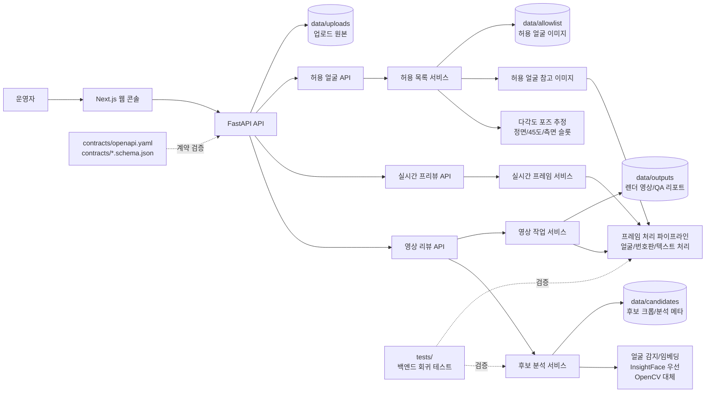

# PersonaMask 개발자 가이드

이 문서는 PersonaMask의 개발 환경, 코드 구조, 테스트, Git 관리 기준을 정리합니다.

## 기술 스택

- 백엔드: FastAPI, OpenCV, ONNX Runtime, 선택적 InsightFace/ArcFace.
- 프론트엔드: Next.js App Router, React, TypeScript.
- 계약 문서: `contracts/openapi.yaml`, `contracts/video.schema.json`, `contracts/realtime.schema.json`.
- 런타임 데이터: `data/uploads`, `data/candidates`, `data/outputs`, `data/allowlist`.

## 아키텍처



## 프로젝트 구조

```text
app/
  api/routers/        FastAPI 라우터
  core/               설정과 공통 런타임 구성
  pipelines/          프레임/영상 처리 파이프라인
  repositories/       작업과 세션 상태 저장 계층
  schemas/            Pydantic 요청/응답 모델
  services/           후보 분석, 영상 작업, 실시간 처리, 허용 목록 서비스
contracts/            OpenAPI와 JSON Schema 계약
data/                 로컬 런타임 산출물
docs/                 문서와 README 이미지 자산
tests/                백엔드 회귀 테스트
web/                  Next.js 프론트엔드
```

## 로컬 실행

백엔드:

```bash
python -m venv .venv
source .venv/bin/activate
pip install -r requirements.txt
cp .env.example .env
python -m app.main --check
python -m app.main --host 127.0.0.1 --port 8001
```

프론트엔드:

```bash
cd web
npm install
npm run dev
```

기본 프론트엔드 주소는 `http://127.0.0.1:3000`입니다.

## 환경 변수

일반 백엔드 설정값은 `.env.example`에 정리되어 있습니다.

얼굴 감지 관련 주요 값:

```bash
PERSONAMASK_FACE_DETECTOR=auto
PERSONAMASK_INSIGHTFACE_ROOT=/home/bys0626/.insightface
PERSONAMASK_INSIGHTFACE_MODEL=buffalo_l
PERSONAMASK_ONNXRUNTIME_PROVIDER=CPUExecutionProvider
PERSONAMASK_INSIGHTFACE_CTX_ID=-1
```

`CUDAExecutionProvider`는 호스트 GPU 드라이버와 ONNX Runtime CUDA 경로를 먼저 검증한 뒤 사용해야 합니다. GPU 경로가 준비되지 않았거나 InsightFace 초기화가 실패하면 OpenCV 대체 경로로 실행됩니다.

## 주요 API

영상 리뷰:

- `POST /api/v1/videos/candidates`
- `GET /api/v1/videos/candidates/{analysis_id}/{candidate_id}` (`X-Access-Token` 필요)
- `POST /api/v1/videos/jobs`
- `GET /api/v1/videos/jobs/{job_id}` (`X-Access-Token` 필요)
- `POST /api/v1/videos/jobs/{job_id}/cancel` (`X-Access-Token` 필요)
- `GET /api/v1/videos/jobs/{job_id}/result` (`X-Access-Token` 필요)
- `GET /api/v1/videos/jobs/{job_id}/contact-sheet` (`X-Access-Token` 필요)
- `GET /api/v1/videos/jobs/{job_id}/qa-report.json` (`X-Access-Token` 필요)
- `GET /api/v1/videos/jobs/{job_id}/qa-report.md` (`X-Access-Token` 필요)

실시간 프리뷰와 허용 얼굴:

- `POST /api/v1/realtime/sessions`
- `POST /api/v1/realtime/sessions/{session_id}/frames`
- `DELETE /api/v1/realtime/sessions/{session_id}`
- `POST /api/v1/realtime/face-pose`
- `POST /api/v1/allowlist/faces`
- `GET /api/v1/allowlist/faces`
- `DELETE /api/v1/allowlist/faces/{person_id}`

운영 상태:

- `GET /api/v1/health`
- `GET /api/v1/diagnostics/runtime`
- `GET /api/v1/presets`

## 얼굴 감지 품질 확인

후보 리뷰 품질을 보장하려면 InsightFace `buffalo_l` 경로를 사용하는 것이 좋습니다.


## 테스트

백엔드 전체 테스트:

```bash
NO_ALBUMENTATIONS_UPDATE=1 MPLCONFIGDIR=/tmp/matplotlib PYTHONPYCACHEPREFIX=/tmp/pycache \
  conda run --no-capture-output -n bys python -m unittest discover -s tests -v
```

얼굴 감지 회귀 테스트:

```bash
NO_ALBUMENTATIONS_UPDATE=1 MPLCONFIGDIR=/tmp/matplotlib \
  conda run --no-capture-output -n bys python -m unittest tests.test_video_identity_quality -v
```

프론트엔드 검증:

```bash
npm --prefix web run typecheck
npm --prefix web run lint
npm --prefix web run build
```

공통 diff 검사:

```bash
git diff --check
```

`tests/test_video_identity_quality.py`는 로컬에 `test_video.mp4`가 있을 때 실제 영상 기반으로 동작합니다. 실제 사람이 포함된 테스트 영상은 공개 저장소에 올리지 말고 로컬 파일로 유지하세요.

## Git 관리 기준

- 변경 전 `git status --short --branch`로 작업 트리를 확인합니다.
- 커밋은 기능/문서/테스트 단위로 작게 나눕니다.
- `data/`, `test_video.mp4`, `web/.next`, `web/node_modules` 같은 런타임 산출물과 의존성 폴더는 커밋하지 않습니다.
- UI 변경은 가능하면 README 캡처와 설명을 함께 갱신합니다.
- 커밋 메시지는 변경 이유를 첫 줄에 짧게 쓰고 밑에 자세하게 작성하고, 검증한 명령과 검증하지 못한 부분을 본문에 남깁니다.
- 푸시 전 `git log -1 --pretty=full`로 작성자, 커미터, 메시지를 확인합니다.
