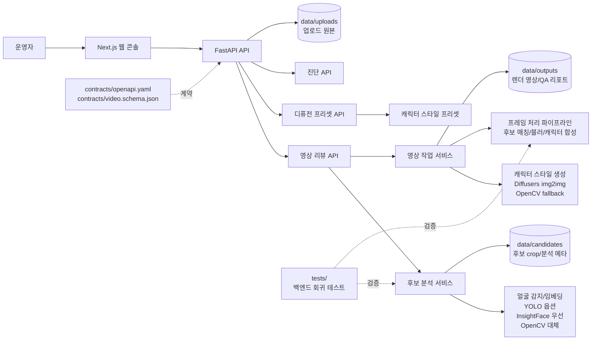

# PersonaMask 개발자 가이드

이 문서는 PersonaMask의 업로드 영상 리뷰 흐름, 로컬 실행 방법, API, 디퓨전 캐릭터 리댁션 설정, 테스트 절차를 정리합니다.

## 기술 스택

- 백엔드: FastAPI, OpenCV, ONNX Runtime, 선택적 YOLO/InsightFace/ArcFace.
- 캐릭터 변환: 선택적 Diffusers img2img 파이프라인, OpenCV fallback.
- 프론트엔드: Next.js App Router, React, TypeScript.
- 계약 문서: `contracts/openapi.yaml`, `contracts/video.schema.json`.
- 런타임 데이터: `data/uploads`, `data/candidates`, `data/outputs`.

## 아키텍처



## 프로젝트 구조

```text
app/
  api/routers/        FastAPI 라우터
  core/               설정과 GPU/런타임 진단
  pipelines/          프레임 처리, 영상 처리, 캐릭터 스타일 생성
  repositories/       영상 작업 상태 저장 계층
  schemas/            Pydantic 요청/응답 모델
  services/           후보 분석, 영상 작업, 진단 서비스
contracts/            OpenAPI와 영상 JSON Schema 계약
data/                 로컬 런타임 산출물, Git 제외
docs/                 개발자 문서와 README 이미지 자산
tests/                백엔드 회귀 테스트
web/                  Next.js 프론트엔드
web/public/showcase/  영상 리뷰 예시 이미지
```

## 로컬 실행

백엔드:

```bash
python -m venv .venv
source .venv/bin/activate
pip install -r requirements.txt
python -m app.main --check
python -m app.main --host 127.0.0.1 --port 8001
```

프론트엔드:

```bash
cd web
npm install
npm run dev
```

기본 프론트엔드 주소는 `http://127.0.0.1:3000`입니다.

## 디퓨전 캐릭터 리댁션

기본 백엔드는 `character` 후보 액션을 받으면 후보 얼굴 crop별 캐릭터 스타일 자산을 먼저 생성하고, 렌더링 중 매칭된 얼굴 영역에 합성합니다.

실제 Diffusers 모델을 사용하려면 선택 의존성을 설치합니다.

```bash
pip install -r requirements-diffusion.txt
```

주요 환경 변수:

```bash
PERSONAMASK_DIFFUSION_ENABLED=1
PERSONAMASK_DIFFUSION_MODEL=runwayml/stable-diffusion-v1-5
PERSONAMASK_DIFFUSION_LOCAL_ONLY=1
PERSONAMASK_DIFFUSION_DEVICE=cuda
PERSONAMASK_DIFFUSION_STEPS=18
PERSONAMASK_DIFFUSION_STRENGTH=0.62
PERSONAMASK_DIFFUSION_GUIDANCE_SCALE=6.5
```

`PERSONAMASK_DIFFUSION_LOCAL_ONLY=1`이면 이미 로컬 캐시에 있는 모델만 사용합니다. 모델이 없거나 패키지가 설치되지 않았을 때는 OpenCV 기반 익명 캐릭터 스타일 fallback으로 렌더를 계속하고, QA 리포트의 `character_style.warnings`에 사유를 남깁니다.

## 얼굴 감지 설정

후보 리뷰 품질을 보장하려면 InsightFace `buffalo_l` 경로를 사용하는 것이 좋습니다.

```bash
PERSONAMASK_FACE_DETECTOR=auto
PERSONAMASK_INSIGHTFACE_ROOT=/home/bys0626/.insightface
PERSONAMASK_INSIGHTFACE_MODEL=buffalo_l
PERSONAMASK_ONNXRUNTIME_PROVIDER=CPUExecutionProvider
PERSONAMASK_INSIGHTFACE_CTX_ID=-1
```

`CUDAExecutionProvider`는 호스트 GPU 드라이버와 ONNX Runtime CUDA 경로를 먼저 검증한 뒤 사용해야 합니다. GPU 경로가 준비되지 않았거나 InsightFace 초기화가 실패하면 OpenCV 대체 경로로 실행됩니다.

YOLO 얼굴 검출 경로도 선택적으로 사용할 수 있습니다. 이 경로는 기본 설치에 포함하지 않으며, 얼굴 검출용 YOLO 모델 파일을 별도로 준비한 경우에만 활성화합니다.

```bash
pip install -r requirements-yolo.txt

PERSONAMASK_FACE_DETECTOR=yolo
PERSONAMASK_YOLO_FACE_MODEL=/path/to/yolo-face.pt
PERSONAMASK_YOLO_FACE_CONF=0.35
PERSONAMASK_YOLO_FACE_CLASSES=face
```

`PERSONAMASK_FACE_DETECTOR=yolo`인데 모델 경로가 비어 있거나 `ultralytics`가 설치되지 않은 경우에는 기존 InsightFace/OpenCV 경로로 돌아갑니다. COCO 기반 일반 YOLO 모델은 얼굴이 아니라 사람 전체를 잡을 수 있으므로, 발표나 데모에서는 얼굴 검출용 YOLO 모델을 쓰는 것이 안전합니다.

## 주요 API

영상 리뷰:

- `POST /api/v1/videos/candidates`
- `GET /api/v1/videos/candidates/{analysis_id}/{candidate_id}` (`X-Access-Token` 필요)
- `POST /api/v1/videos/jobs`
- `GET /api/v1/videos/jobs/{job_id}` (`X-Access-Token` 필요)
- `POST /api/v1/videos/jobs/{job_id}/cancel` (`X-Access-Token` 필요)
- `GET /api/v1/videos/jobs/{job_id}/result` (`X-Access-Token` 필요)
- `GET /api/v1/videos/jobs/{job_id}/contact-sheet` (`X-Access-Token` 필요)
- `GET /api/v1/videos/jobs/{job_id}/qa-report.json` (`X-Access-Token` 필요)
- `GET /api/v1/videos/jobs/{job_id}/qa-report.md` (`X-Access-Token` 필요)

운영 상태:

- `GET /api/v1/health`
- `GET /api/v1/diagnostics/runtime`
- `GET /api/v1/presets`

## 테스트

백엔드 전체 테스트:

```bash
NO_ALBUMENTATIONS_UPDATE=1 MPLCONFIGDIR=/tmp/matplotlib PYTHONPYCACHEPREFIX=/tmp/pycache \
  conda run --no-capture-output -n bys python -m unittest discover -s tests -v
```

얼굴 감지 회귀 테스트:

```bash
NO_ALBUMENTATIONS_UPDATE=1 MPLCONFIGDIR=/tmp/matplotlib \
  conda run --no-capture-output -n bys python -m unittest tests.test_video_identity_quality -v
```

프론트엔드 검증:

```bash
npm --prefix web run typecheck
npm --prefix web run lint
npm --prefix web run build
```

공통 diff 검사:

```bash
git diff --check
```

`tests/test_video_identity_quality.py`는 로컬에 `test_video.mp4`가 있고 InsightFace 모델이 준비된 경우에만 실제 영상 기반으로 동작합니다. 실제 사람이 포함된 테스트 영상은 공개 저장소에 올리지 말고 로컬 파일로 유지하세요.

## Git 관리 기준

- 변경 전 `git status --short --branch`로 작업 트리를 확인합니다.
- 커밋은 기능/문서/테스트 단위로 작게 나눕니다.
- `data/`, `test_video.mp4`, `web/.next`, `web/node_modules` 같은 런타임 산출물과 의존성 폴더는 커밋하지 않습니다.
- 루트의 PPT/발표 초안, 로컬 테스트 영상, 임시 showcase 원본, 뉴스 원본 이미지는 커밋하지 않습니다.
- README와 UI에서 실제로 쓰는 자산만 남깁니다. 현재 공개 자산은 `docs/assets/video-review-ui.png`와 `web/public/showcase/`입니다.
- UI 변경은 가능하면 README 캡처와 설명을 함께 갱신합니다.
- 커밋 메시지는 변경 이유를 첫 줄에 짧게 쓰고, 검증한 명령과 검증하지 못한 부분을 본문에 남깁니다.
- 푸시 전 `git log -1 --pretty=full`로 작성자, 커미터, 메시지를 확인합니다.
